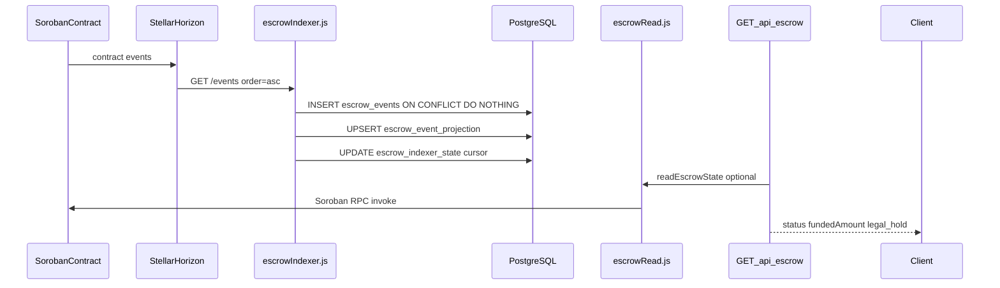
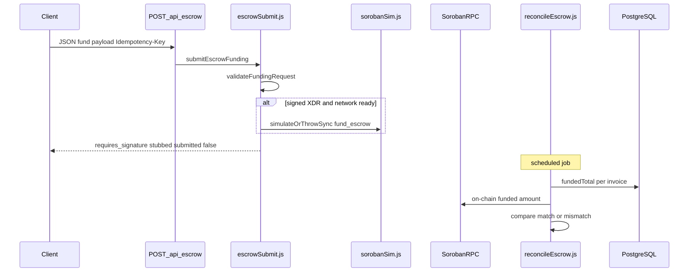

# Escrow Integration Overview

> **Authoritative end-to-end guide** for LiquiFact escrow on Stellar/Soroban.  
> Deep dives: [indexing strategy](./escrow-indexing-strategy.md) · [deployment model](./escrow-deployment-model.md) · [signing ops](./ops-signing.md) · [reconciliation ops](./ops-reconcile.md) · [invoice correlation](./invoice-correlation.md)

---

## Executive summary

- LiquiFact escrows invoice funding on **Stellar/Soroban**; the Express backend **indexes events**, **reads state**, **orchestrates funding** (stub today), and **reconciles** DB totals against chain.
- Three backend paths work together: **index/read** (Horizon → PostgreSQL → API), **fund/submit** (`escrowSubmit`), **reconcile** (`reconcileEscrow`).
- **`invoiceId`** is the primary correlation key (contract argument for Soroban; optional memo for classic payments — see [invoice-correlation.md](./invoice-correlation.md)).
- The repo’s checked-in Soroban crate is **`BountyContract`** ([`contracts/src/lib.rs`](../contracts/src/lib.rs)); product docs and services target **`LiquifactEscrow`** with operations such as **`fund_escrow`** — map both when reading code.
- Several production paths are **stubs or mocks** (live Soroban submit disabled, reconciliation DB/query mocked, minimal `src/app.js` escrow GET). This doc labels **current** vs **target** behavior.

### Live vs stub (at a glance)

| Area | Module | Current repo behavior | Target production behavior |
|------|--------|----------------------|----------------------------|
| Event ingest | [`src/jobs/escrowIndexer.js`](../src/jobs/escrowIndexer.js) | Horizon poll → `escrow_events` / `escrow_event_projection` | Same; optional Captive Core later |
| Escrow read (service) | [`src/services/escrowRead.js`](../src/services/escrowRead.js) | Soroban RPC **stubs** for `get_escrow_state`, `get_legal_hold` | Real `LiquifactEscrow` contract reads |
| Escrow read (minimal app) | [`src/app.js`](../src/app.js) | `GET /api/escrow/:invoiceId` via `resolveEscrowAddress` + placeholder Soroban op | Wire to `readEscrowState` + projection/cache |
| Funding | [`src/services/escrowSubmit.js`](../src/services/escrowSubmit.js) | Validates payload; **`submitted: false`**; optional simulation | Build/sign/submit `fund_escrow` (delegated or custodial) |
| Reconciliation | [`src/jobs/reconcileEscrow.js`](../src/jobs/reconcileEscrow.js) | Mock invoices + mock on-chain amounts | Real DB + contract `funded_amount` |
| On-chain contract | [`contracts/src/lib.rs`](../contracts/src/lib.rs) | `create_bounty` / `release_bounty` | `LiquifactEscrow` invoice escrow API |

---

## Derived fields and ledger time

Three display fields are derived server-side by
[`src/services/escrowDerived.js`](../src/services/escrowDerived.js) so the UI
receives ready-to-render values:

| Field | Source |
|-------|--------|
| `apyPercent` | `annualRatePercent` rounded to 2 dp (simple annual rate, no compounding) |
| `fundedPercent` | `(fundedAmount / totalAmount) × 100`, 2 dp |
| `daysToMaturity` | Days from reference time to `maturityDate`; negative = overdue |

### Time-source precedence for `daysToMaturity`

To prevent a clock-skewed host from mislabelling invoices as overdue or
not-yet-mature, the computation uses the **Stellar ledger close time** when it
is available:

```
1. opts.ledgerCloseTime   — Unix epoch seconds from the Soroban ledgerCloseTime
                            field; sourced via readEscrowState / readEscrowStateWithAttestations.
2. opts.now               — Explicit Date override (tests only).
3. new Date()             — Server wall clock; last-resort fallback.
                            ⚠ Caveat: may diverge from ledger time on a skewed
                            host; always prefer ledgerCloseTime in production.
```

Callers that already have an escrow state from `readEscrowState` can pass the
`ledgerCloseTime` field directly:

```js
const state = await readEscrowState(invoiceId);
const derived = computeEscrowDerivedFields(state, {
  ledgerCloseTime: state.ledgerCloseTime, // epoch seconds; may be undefined
});
```

When `ledgerCloseTime` is absent (e.g. the Soroban stub does not return it),
the function falls back transparently to the server wall clock with a warn-level
log, preserving the existing behaviour.

### Rounding

All percent values use `Math.round(x * 100) / 100` (round-half-up at 2 dp) to
avoid IEEE 754 drift in UI rendering.

---

## Component map

| Concern | Path | Key symbols |
|---------|------|-------------|
| HTTP entry | [`src/index.js`](../src/index.js), [`src/app.js`](../src/app.js) | `startServer`, `createApp`, `GET/POST /api/escrow` |
| Invoice → address | [`src/config/escrowMap.js`](../src/config/escrowMap.js) | `resolveEscrowAddress`, `ESCROW_ADDR_BY_INVOICE` |
| Stellar network | [`src/config/stellar.js`](../src/config/stellar.js), [`src/config/index.js`](../src/config/index.js) | `getStellarConfig`, Zod `validate()` |
| Soroban wrapper | [`src/services/soroban.js`](../src/services/soroban.js) | `callSorobanContract` (retries) |
| Read + legal hold | [`src/services/escrowRead.js`](../src/services/escrowRead.js) | `readEscrowState`, `fetchLegalHold` |
| Batch read | [`src/services/escrowBatchRead.js`](../src/services/escrowBatchRead.js) | Uses `readEscrowState` with concurrency limits |
| Funding stub | [`src/services/escrowSubmit.js`](../src/services/escrowSubmit.js) | `submitEscrowFunding`, `FUND_OPERATION = 'fund_escrow'` |
| Simulation | [`src/services/sorobanSim.js`](../src/services/sorobanSim.js) | `simulateOrThrowSync` (when signed XDR present) |
| Indexer job | [`src/jobs/escrowIndexer.js`](../src/jobs/escrowIndexer.js) | `createEscrowIndexer`, `runEscrowIndexerCycle`, `persistEscrowEvent` |
| Reconciliation job | [`src/jobs/reconcileEscrow.js`](../src/jobs/reconcileEscrow.js) | `performReconciliation`, `reconcileInvoice` |
| Health | [`src/services/health.js`](../src/services/health.js) | `checkReconciliationHealth`, `performHealthChecks` |
| DB schema | [`migrations/20260427123000_create_escrow_event_index_tables.sql`](../migrations/20260427123000_create_escrow_event_index_tables.sql) | `escrow_events`, `escrow_event_projection`, `escrow_indexer_state` |
| On-chain (repo) | [`contracts/src/lib.rs`](../contracts/src/lib.rs) | `BountyContract::initialize`, `create_bounty`, `release_bounty`, `get_bounty` |

### Target vs checked-in contract

**Product / service layer** ([`escrowSubmit.js`](../src/services/escrowSubmit.js), [`escrowRead.js`](../src/services/escrowRead.js), [ops-signing](./ops-signing.md)) assumes **`LiquifactEscrow`** with:

- `fund_escrow` — investor funding into invoice escrow  
- `get_escrow_state` / `get_legal_hold` — read paths  
- Events consumed by the indexer (e.g. funded / settled)

**Repository contract today** ([`contracts/src/lib.rs`](../contracts/src/lib.rs)) is **`BountyContract`**:

- `initialize(fee_recipient)` — once per deployment  
- `create_bounty(creator, hunter, token, amount, protocol_fee_bps)` — pulls tokens into contract  
- `release_bounty(id)` — pays hunter and fee recipient  
- `get_bounty(id)` — view helper  

Use the bounty contract to understand Soroban patterns in-repo; use the LiquifactEscrow names when tracing the **intended** invoice product flow.

---

## Flow A — On-chain event → API read

### Sequence



### Indexer ([`src/jobs/escrowIndexer.js`](../src/jobs/escrowIndexer.js))

- **Source:** Horizon Events API — `fetchEscrowEventsFromHorizon({ baseUrl, cursor, limit })` calls `GET {STELLAR_HORIZON_URL}/events?order=asc`.
- **Defaults:** `STELLAR_HORIZON_URL` → `https://horizon-testnet.stellar.org`; batch size **100**; poll interval **15s** (see env table below).
- **Normalization:** `normalizeEvent()` requires `eventId`, `eventType`, positive `ledgerSequence`, and `invoiceId` matching `^[a-zA-Z0-9_-]{1,128}$`.
- **Raw log:** `createKnexEscrowEventStore().upsertEvent()` → table **`escrow_events`** (`event_id` PK). Duplicates ignored via `onConflict('event_id').ignore()`.
- **Projection:** `shouldReplaceProjection()` keeps the latest event per invoice: higher **`ledger_sequence`** wins; on tie, lexicographically greater **`paging_token`**. `upsertProjection()` writes **`escrow_event_projection`** (`invoice_id` PK).
- **Cursor:** Key **`horizon_cursor`** in **`escrow_indexer_state`**; saved only when `nextCursor !== cursor` after a successful cycle (`runEscrowIndexerCycle`).
- **Failure handling:** Invalid events are **skipped** (warn log); cursor still advances when the batch completes so ingestion does not deadlock.
- **Runtime:** `createEscrowIndexer().start()` runs `runCycle` on an interval when `ESCROW_INDEXER_ENABLED=true` (feature-flagged).

### Read path

**Intended production path**

1. Resolve contract/address: `resolveEscrowAddress(invoiceId)` from [`escrowMap.js`](../src/config/escrowMap.js) (env JSON `ESCROW_ADDR_BY_INVOICE`).
2. Prefer latest **`escrow_event_projection`** row for fast off-chain summary (indexer).
3. Enrich with live Soroban read: [`readEscrowState()`](../src/services/escrowRead.js) — concurrent base state + `fetchLegalHold()`; optional token metadata via [`tokenMeta.js`](../src/services/tokenMeta.js).
4. Optional Redis cache: `REDIS_ESCROW_CACHE_*` (see `.env.example`).

**Current minimal app** ([`src/app.js`](../src/app.js))

- `GET /api/escrow/:invoiceId` trims `invoiceId`, calls `resolveEscrowAddress`, wraps a **placeholder** Soroban operation in `callSorobanContract`, sets header **`X-Escrow-Address`**, returns `{ status: 'not_found', fundedAmount: 0 }` in the stub path.
- Full-feature routes/tests often mount [`escrowRead.js`](../src/services/escrowRead.js) directly (see `tests/escrow.read.test.js`, `tests/escrow.legalhold.test.js`).

**`readEscrowState` return shape (target):** `invoiceId`, `status`, `fundedAmount`, `legal_hold`, `funding_token`.

---

## Flow B — Funding: validate → submit stub → reconciliation

### Sequence



### Funding ([`src/services/escrowSubmit.js`](../src/services/escrowSubmit.js))

- **Entry:** `submitEscrowFunding(payload, options)` — never signs or submits live transactions (`controls.liveSubmissionEnabled: false`).
- **Operation name:** `fund_escrow` (`FUND_OPERATION`) in `buildFundingIntent()`.
- **Signing modes** (`ESCROW_SIGNING_MODE`):
  - **`delegated`** (default): Client must supply `signedTransactionXdr` for live path; stub returns `requires_signature` when missing.
  - **`custodial`**: Requires `ESCROW_CUSTODIAL_SIGNING_ENABLED=true` plus KMS provider/key env vars; stub returns `requires_configuration` if gates incomplete.
- **Validation highlights:**
  - `invoiceId` — `IDENTIFIER_PATTERN` (128 chars, URL-safe charset).
  - `funderPublicKey` / issuers — Stellar `G...` (56 chars).
  - `amount` — positive, max 7 decimal places (`AMOUNT_PATTERN`).
  - `metadata` — max **2048** bytes serialized (`MAX_METADATA_BYTES`).
  - `memo` — max **64** chars.
  - `signedTransactionXdr` — bounded base64 (`XDR_PATTERN`); accepted but **not submitted** in stub.
- **Idempotency:** `Idempotency-Key` header or body (`IDEMPOTENCY_KEY_PATTERN`); live implementation must bind to invoice, amount, asset, funder, and tx hash (see [ops-signing](./ops-signing.md)).
- **Simulation:** When `signedTransactionXdr` is set and `config.network.ready`, `simulateBeforeSubmit()` calls [`simulateOrThrowSync`](../src/services/sorobanSim.js) — result attached under `simulation` in the response; failures do not throw from the stub.
- **Network readiness** (`resolveSigningConfig`): needs `SOROBAN_RPC_URL`, `STELLAR_NETWORK_PASSPHRASE`, `LIQUIFACT_ESCROW_CONTRACT_ID` (`C...` pattern).

Details: [ops-signing.md](./ops-signing.md).

### Reconciliation ([`src/jobs/reconcileEscrow.js`](../src/jobs/reconcileEscrow.js))

- **Purpose:** Detect drift between **DB `fundedTotal`** and **on-chain funded amount** per invoice.
- **Flow:** `performReconciliation()` → `getInvoicesFromDb()` → for each row `reconcileInvoice(id, fundedTotal)` → `getOnChainFundedAmount` wrapped in `callSorobanContract`.
- **Statuses:** `match` | `mismatch` | `error` (`RECONCILE_STATUS`).
- **Health:** Summary stored on `global.reconciliationSummary`; [`checkReconciliationHealth()`](../src/services/health.js) exposes `healthy` | `mismatches` | `stale` (>25h) | `not_run` | `error` on `/ready`.
- **Scheduling:** `scheduleNightlyReconciliation()` enqueues `reconcile_escrow` on [`JobQueue`](../src/workers/jobQueue.js) / [`BackgroundWorker`](../src/workers/worker.js).
- **Current limitation:** `getInvoicesFromDb` and `getOnChainFundedAmount` use **mock data** — production must query real invoices and invoke `LiquifactEscrow` (or projection + RPC).

Details: [ops-reconcile.md](./ops-reconcile.md).

---

## Environment contract

### Stellar network matrix (designed behavior)

Documented in [README](../README.md) and asserted in [`src/config/stellar.test.js`](../src/config/stellar.test.js). **`STELLAR_NETWORK` must match `SOROBAN_RPC_URL` exactly** — custom RPC URLs are rejected.

| `STELLAR_NETWORK` | Required `SOROBAN_RPC_URL` | Passphrase |
|-------------------|---------------------------|------------|
| `TESTNET` | `https://soroban-testnet.stellar.org` | `Test SDF Network ; September 2015` |
| `MAINNET` | `https://soroban.stellar.org` | `Public Global Stellar Network ; September 2014` |
| `FUTURENET` | `https://rpc-futurenet.stellar.org` | `Test SDF Future Network ; October 2022` |

**Boot-time note:** [`src/config/stellar.js`](../src/config/stellar.js) currently exports `getStellarConfig()` reading Zod-validated [`src/config/index.js`](../src/config/index.js). Tests import `validateStellarConfig` from `./stellar` (network/RPC mismatch errors). Wire-up in `src/index.js` may lag README — treat **`stellar.test.js` + README** as the contract for fail-fast pairing.

### Escrow-related variables

| Variable | Default / example | Used by |
|----------|-------------------|---------|
| `ESCROW_SIGNING_MODE` | `delegated` | `escrowSubmit.resolveSigningConfig` |
| `SOROBAN_RPC_URL` | testnet URL | Soroban health, submit, reads |
| `STELLAR_NETWORK` | `TESTNET` | Network/RPC validation (designed) |
| `STELLAR_NETWORK_PASSPHRASE` | testnet phrase | `escrowSubmit`, signing |
| `LIQUIFACT_ESCROW_CONTRACT_ID` | `C...` | Funding intent, simulation |
| `ESCROW_ADDR_BY_INVOICE` | JSON mappings | `resolveEscrowAddress` |
| `ESCROW_CUSTODIAL_SIGNING_ENABLED` | `false` | Custodial gate |
| `ESCROW_CUSTODIAL_KMS_PROVIDER` | — | Custodial gate |
| `ESCROW_CUSTODIAL_KEY_ID` | — | Custodial gate |
| `ESCROW_INDEXER_ENABLED` | `false` | Run indexer background loop |
| `ESCROW_INDEXER_POLL_INTERVAL_MS` | `15000` | `createEscrowIndexer` |
| `ESCROW_INDEXER_BATCH_SIZE` | `100` | `runEscrowIndexerCycle` |
| `STELLAR_HORIZON_URL` | testnet Horizon | `fetchEscrowEventsFromHorizon` |
| `REDIS_ESCROW_CACHE_ENABLED` | `false` | Optional read cache |
| `SOROBAN_MAX_RETRIES` / `SOROBAN_BASE_DELAY` / `SOROBAN_MAX_DELAY` | 3 / 200 / 5000 | [`soroban.js`](../src/services/soroban.js) |

Never commit secrets; use `.env` locally and deployment secret stores.

---

## Walkthrough — trace `inv_demo_001` from chain to API

Assume testnet configuration and a mapping entry in `ESCROW_ADDR_BY_INVOICE`.

1. **Configure env** (see [`.env.example`](../.env.example)): `STELLAR_NETWORK=TESTNET`, matching `SOROBAN_RPC_URL`, `JWT_SECRET`, optional `LIQUIFACT_ESCROW_CONTRACT_ID`, indexer flags.
2. **Map invoice to escrow:** `resolveEscrowAddress('inv_demo_001')` returns the configured Stellar address (today schema validates `G...` in [`escrowMap.js`](../src/config/escrowMap.js); Soroban contract IDs use `C...` via `LIQUIFACT_ESCROW_CONTRACT_ID` for submit/simulation).
3. **On-chain fund (target):** Investor calls **`fund_escrow`** on **`LiquifactEscrow`** with `invoiceId` as contract argument ([invoice-correlation.md](./invoice-correlation.md)). *Scaffold equivalent:* `create_bounty` on **`BountyContract`** emits `bounty_created` event.
4. **Horizon records event** → indexer poll picks it up.
5. **Indexer cycle** (`runEscrowIndexerCycle`):
   - Insert into **`escrow_events`** (idempotent on `event_id`).
   - Update **`escrow_event_projection`** if ledger/token ordering allows.
   - Advance **`escrow_indexer_state.horizon_cursor`**.
6. **Read API:**
   ```bash
   curl -s http://localhost:3001/api/escrow/inv_demo_001 \
     -H "Authorization: Bearer <jwt>"
   ```
   - Minimal app: mapping + Soroban stub response, `X-Escrow-Address` header.
   - Full service: `readEscrowState('inv_demo_001')` → `status`, `fundedAmount`, `legal_hold`.
7. **Funding request (stub):**
   ```bash
   curl -s -X POST http://localhost:3001/api/escrow \
     -H "Authorization: Bearer <jwt>" \
     -H "Idempotency-Key: fund-inv-demo-001-0001" \
     -H "Content-Type: application/json" \
     -d '{
       "invoiceId": "inv_demo_001",
       "funderPublicKey": "GAAAAAAAAAAAAAAAAAAAAAAAAAAAAAAAAAAAAAAAAAAAAAAAAAAAAWHF",
       "amount": "100.0000000",
       "asset": { "code": "XLM" },
       "signingMode": "delegated"
     }'
   ```
   Expect `submitted: false`, `status: requires_signature` (or `requires_configuration` if network env incomplete).
8. **Reconciliation:** After DB records `fundedTotal`, `performReconciliation()` should report **`match`** when on-chain amount equals DB; **`mismatch`** triggers warn logs and unhealthy reconciliation check.

---

## Security assumptions

- **Indexer is read-only** — no Stellar secret keys; invalid events skipped; duplicate `event_id` safe ([indexing strategy](./escrow-indexing-strategy.md)).
- **Funding stub** — no private keys in repo, logs, or API responses; custodial signing only via KMS aliases ([ops-signing](./ops-signing.md)).
- **Input validation** — strict patterns in `escrowSubmit` and `escrowRead`; oversized metadata rejected.
- **Legal hold** — RPC failure defaults to **`legal_hold: false`** in `fetchLegalHold` (warn log); callers needing strict blocking should override via adapter.
- **Idempotency** — required for live submit; stub accepts key for forward compatibility.
- **Rate limiting** — sensitive routes (e.g. `POST /api/escrow`) covered in middleware tests (`src/__tests__/rateLimit.test.js`).
- **Allowlist** — `ESCROW_ADDR_BY_INVOICE` with `allowlistEnabled` prevents arbitrary invoice→address resolution.
- **Deployment invariants** — token/treasury immutability and per-instance isolation ([deployment model](./escrow-deployment-model.md)).

---

## Running components locally (no Docker required)

- **API:** `npm install --no-package-lock && npm run dev` (port **3001**).
- **PostgreSQL:** Native install or any Postgres host; set `DATABASE_URL`; run `npm run db:migrate`.
- **Indexer:** Set `ESCROW_INDEXER_ENABLED=true` and valid `DATABASE_URL`; ensure Horizon URL matches network.
- **Reconciliation:** `node -e "require('./src/jobs/reconcileEscrow').performReconciliation().then(console.log)"` from repo root (uses mocks until DB/Soroban wired).
- **Tests (no DB container):** `npm test -- tests/unit/escrowIndexer.test.js tests/escrowSubmit.stub.test.js`

---

## Related documentation

| Doc | Focus |
|-----|--------|
| [escrow-indexing-strategy.md](./escrow-indexing-strategy.md) | Horizon poller vs Captive Core upgrade |
| [escrow-deployment-model.md](./escrow-deployment-model.md) | Per-instance deployment, invariants, factory risks |
| [ops-signing.md](./ops-signing.md) | Delegated vs custodial signing, KMS, funding API |
| [ops-reconcile.md](./ops-reconcile.md) | Nightly reconciliation, health statuses, alerting |
| [invoice-correlation.md](./invoice-correlation.md) | `invoiceId` on Soroban vs Stellar memo |
| [SOROBAN_SIMULATION.md](./SOROBAN_SIMULATION.md) | Simulation before submit |
| [API-Examples.md](./API-Examples.md) | Additional curl examples |

---

**Maintainers:** Update this overview when wiring `readEscrowState` into `app.js`, implementing live `submitEscrowFunding`, or replacing `BountyContract` with `LiquifactEscrow`.
